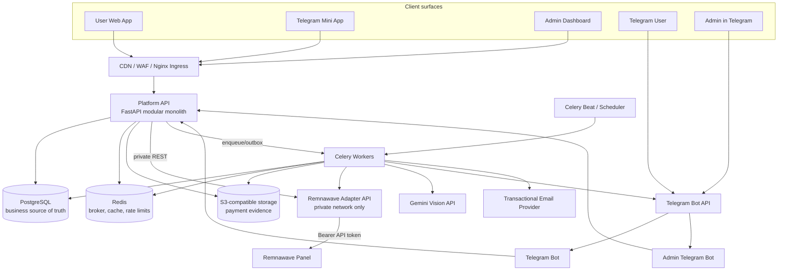
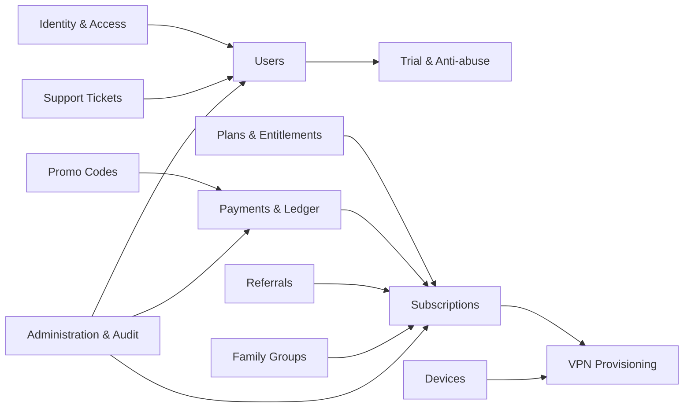
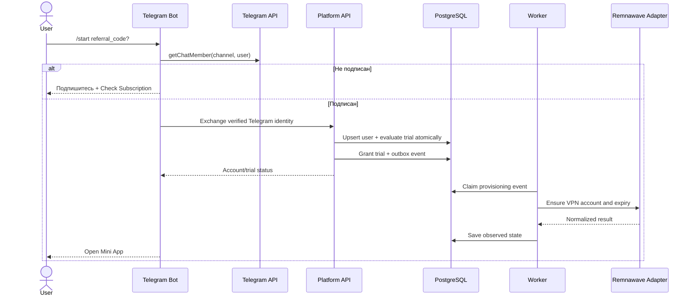
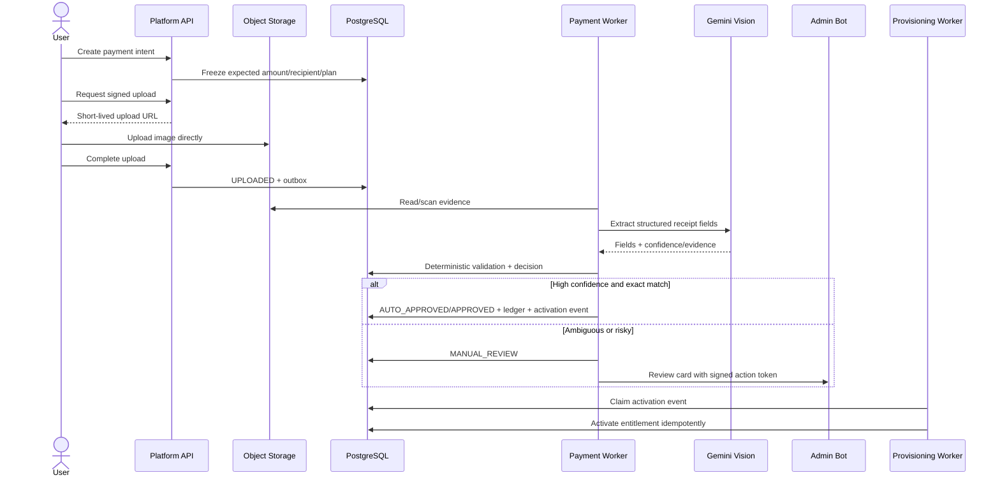

# STEP 1 — System Architecture Design

## 1. Что создано

Спроектирована целевая production-архитектура VPN SaaS-платформы со следующими
контурами:

- Web-приложение пользователя, Telegram Mini App и Admin Dashboard;
- публичный Platform API на FastAPI;
- отдельный внутренний Remnawave Adapter API;
- Telegram Bot и Admin Telegram Bot;
- асинхронные workers для платежей, уведомлений, provisioning и reconciliation;
- PostgreSQL, Redis, S3-совместимое object storage;
- интеграции с Remnawave, Telegram, email и Gemini Vision;
- единая модель безопасности, наблюдаемости и развертывания.

На этом этапе намеренно **не создаются** runtime-код, таблицы и миграции. Полная
database schema относится к STEP 2 и должна следовать за утверждением границ
системы.

## 2. Архитектурные принципы

1. **Platform API — модульный монолит.** Домены изолированы внутри одного
   приложения и одной бизнес-транзакции. Это быстрее и надежнее для первой
   production-версии, чем преждевременные микросервисы.
2. **Vendor isolation.** Remnawave скрыт за отдельным приватным adapter-сервисом.
   Токен панели никогда не попадает в Platform API, frontend или Telegram Bot.
3. **PostgreSQL — источник истины для бизнеса.** Панель не определяет, был ли
   платеж подтвержден, кому принадлежит family-подписка или начислен referral.
4. **Асинхронность без потери событий.** Долгие и внешние операции выполняются
   workers через transactional outbox и повторяемые idempotent jobs.
5. **Zero trust между внешним клиентом и API.** Весь доступ проверяется на
   сервере; Telegram `initData`, роли, ownership и лимиты не доверяются UI.
6. **Observability by default.** Correlation ID проходит через API, очередь,
   адаптер и внешнюю интеграцию; метрики и структурированные логи проектируются
   до реализации.

## 3. Контейнерная архитектура



### Почему не набор бизнес-микросервисов

Платеж, промокод, referral reward и активация подписки образуют один тесно
связанный consistency boundary. На старте разделение на отдельные Billing,
Subscription и Referral сервисы добавило бы distributed transactions, network
failures и сложную эксплуатацию без подтвержденной необходимости. Модульные
границы оставляют возможность позднее вынести домен по нагрузке или команде.

## 4. Deployment units и ответственность

| Компонент | Доступ | Ответственность | Собственные секреты |
|---|---|---|---|
| `web` | Public | React UI, TMA и admin route bundles | Нет server secrets |
| `platform-api` | Public через ingress | Auth, REST API, RBAC, orchestration, business state | JWT keys, DB, Redis, object storage |
| `worker` | Private | AI verification, provisioning, email/Telegram, outbox, reconciliation | Gemini/email/Telegram credentials; доступ к adapter |
| `scheduler` | Private, singleton | Периодические задания и expiry/reconciliation triggers | Redis/DB |
| `telegram-bot` | Telegram webhook | Канал-проверка, onboarding, deep links | User bot token |
| `admin-bot` | Telegram webhook/private admins | Payment review approve/reject | Admin bot token |
| `remnawave-adapter` | Только private network | Anti-corruption layer для Remnawave v3.3.2 | Remnawave base URL/token |
| `postgres` | Private | Durable business state, outbox, audit | DB credentials |
| `redis` | Private | Broker, locks, counters, short cache | Redis credentials |
| `object-storage` | Private/signed URL | Зашифрованные платежные screenshots | Storage credentials |

Bots не обращаются к базе напрямую: они являются доверенными API-клиентами с
узкими service scopes. Workers используют те же application services, что и
HTTP-слой, поэтому бизнес-правила не дублируются.

## 5. Доменные модули Platform API



### Границы модулей

- **Identity & Access:** email OTP, Telegram identity link, sessions, JWT,
  refresh rotation, roles, service identities.
- **Users:** профиль, status/blocking, privacy settings и связь внешних identity.
- **Trial & Anti-abuse:** eligibility, IP/fingerprint risk signals, trial grant;
  fingerprint — риск-сигнал, а не единственное доказательство личности.
- **Plans & Entitlements:** тариф, длительность, лимит устройств/участников,
  traffic policy и price snapshot.
- **Subscriptions:** lifecycle и расчет доступа. Не хранит «баланс» как
  изменяемое число без истории.
- **Payments & Ledger:** upload evidence, verification, approval и append-only
  ledger transaction. Один `operation_number + recipient` не может быть
  использован повторно.
- **Promo Codes:** eligibility, redemption limits, discount/free grant.
- **Referrals:** immutable attribution и отдельные reward entries для обеих
  сторон; защита от self-referral.
- **Family Groups:** owner/member/invite, seat limits и entitlement projection.
- **Devices:** локальные labels/slots плюс observed Remnawave HWIDs.
- **VPN Provisioning:** желаемое состояние VPN account, команды adapter’у и
  reconciliation.
- **Support:** ticket state machine, messages, attachments и SLA timestamps.
- **Administration & Audit:** RBAC policies, moderation commands, immutable audit.

Прямые импорты между модулями ограничиваются application contracts и domain
events. HTTP routers не изменяют модели чужого модуля напрямую.

## 6. Источники истины и согласованность

| Данные | Source of truth | Модель согласованности |
|---|---|---|
| Пользователь, identity, роли | PostgreSQL | Strong transaction |
| Тариф, payment, ledger | PostgreSQL | Strong transaction |
| Commercial subscription | PostgreSQL | Strong transaction |
| VPN account/status/expiry | Remnawave (effective), PostgreSQL (desired + snapshot) | Eventual + reconciliation |
| Family membership/referrals/promo | PostgreSQL | Strong transaction |
| HWID устройства | Remnawave observed, PostgreSQL metadata | Eventual |
| Rate-limit counters/OTP attempts | Redis | Ephemeral, fail policy per endpoint |
| Payment screenshot | Object storage | Durable object + DB metadata |
| Audit log | PostgreSQL append-only | Same transaction as admin action |

Ключевой шаблон provisioning — **desired vs observed state**. Подписка сначала
получает целевое состояние в PostgreSQL, затем outbox-команда приводит
Remnawave к нему. Ошибка панели не откатывает подтвержденный платеж; job
повторяется, а после лимита попадает в dead-letter/manual operations queue.

## 7. Главные state machines

### Subscription

`PENDING → ACTIVE → GRACE_PERIOD → EXPIRED`

Дополнительные переходы: `ACTIVE/GRACE_PERIOD → SUSPENDED`, восстановление из
`SUSPENDED`, плановая отмена через `cancel_at_period_end`. История периодов
хранится отдельно; изменение тарифа не перезаписывает старую покупку.

### Payment

`UPLOADED → ANALYZING → AUTO_APPROVED | MANUAL_REVIEW → APPROVED | REJECTED`

Технические ветки: `ANALYSIS_FAILED → MANUAL_REVIEW`, `APPROVED → ACTIVATION_PENDING
→ ACTIVATED`. Повторное approve идемпотентно и не создает второй ledger entry.

### Ticket

`OPEN ↔ IN_PROGRESS ↔ WAITING_USER → CLOSED`

Переоткрытие — отдельное разрешенное действие с audit event, а не произвольная
замена status.

### VPN provisioning command

`PENDING → PROCESSING → SUCCEEDED` либо `RETRY_SCHEDULED → DEAD_LETTER`.

## 8. Ключевые пользовательские сценарии

### Telegram onboarding и trial



Перед выдачей trial сервер проверяет unique Telegram ID, подтвержденные identity,
предыдущие grants, IP velocity, device signal и referral anomalies. Успешное
`getChatMember` кэшируется кратковременно, но проверяется повторно перед grant.

### Email OTP

1. `POST /auth/email/start` нормализует email, применяет IP/email/device rate
   limits и всегда отвечает нейтрально, чтобы не раскрывать наличие аккаунта.
2. Одноразовый код генерируется CSPRNG, в БД/Redis хранится только keyed hash;
   TTL 10 минут, максимум 5 попыток, resend cooldown.
3. `POST /auth/email/verify` атомарно потребляет challenge, создает/link identity,
   запускает trial eligibility и выдает session tokens.
4. Подозрительный риск не обязательно блокирует регистрацию: trial может быть
   отправлен на manual/risk hold.

### Payment screenshot



Admin callback содержит короткоживущий signed action token, payment version и
admin identity. Optimistic locking не позволяет двум администраторам принять
конфликтующие решения.

### Family entitlement

Owner владеет оплаченной subscription и family group. Member получает
производный entitlement, но не копию подписки. Добавление/удаление member
блокируется row lock’ом группы, проверяет seat limit и публикует provisioning
event. Потеря entitlement owner’ом отключает доступ участников, сохраняя саму
группу и историю membership.

## 9. Контракт Remnawave Adapter

Основание: предоставленная спецификация **Remnawave API v3.3.2** (OpenAPI 3.0,
155 paths). Panel DTO не используется за пределами adapter.

### Внутренний API (план)

| Domain operation | Adapter endpoint | Remnawave v3.3.2 mapping |
|---|---|---|
| Создать VPN account | `POST /internal/v1/accounts` | `POST /api/users` |
| Получить status | `GET /internal/v1/accounts/{external_id}` | `GET /api/users/{userId}` |
| Изменить account policy | `PATCH /internal/v1/accounts/{external_id}` | `PATCH /api/users` |
| Disable/enable | `POST .../disable`, `POST .../enable` | `/api/users/{userId}/actions/*` |
| Продлить expiry | `POST .../extend` | `/api/users/{userId}/actions/extend` |
| Получить subscription data | `GET .../subscription` | `/api/subscriptions/by-id/{userId}` |
| Список устройств | `GET .../devices` | `GET /api/hwid/devices/{userId}` |
| Создать HWID устройство | `POST .../devices` | `POST /api/hwid/devices` |
| Удалить устройство | `DELETE .../devices/{hwid}` | `POST /api/hwid/devices/delete` |

Уточнение STEP 5: детальная проверка предоставленной OpenAPI v3.3.2 подтвердила
`POST /api/hwid/devices`. `create_device()` атомарно резервирует локальный slot и
создает durable-команду; отдельный adapter вызывает поддерживаемую panel API
операцию, после чего reconciliation переводит устройство в `observed`.

### Надежность adapter

- mTLS или service JWT между Platform API/worker и adapter;
- bearer token панели только в secret manager;
- connect timeout 2s, response timeout 10s (настраиваемые);
- retry только для безопасных/idempotent операций и transient 429/5xx;
- idempotency key и локальная дедупликация команд создания;
- circuit breaker, bounded concurrency, structured error codes;
- periodic reconciliation `desired_state ↔ Remnawave observed_state`;
- логирование без subscription URL, token, UUID short link и персональных данных.

## 10. API boundary

Все public endpoint’ы версионируются `/api/v1`. Клиенты используют Platform API,
никогда Remnawave Adapter напрямую.

Планируемые route groups:

```text
/api/v1/auth/*
/api/v1/me/*
/api/v1/plans
/api/v1/subscriptions/*
/api/v1/devices/*
/api/v1/payments/*
/api/v1/families/*
/api/v1/referrals/*
/api/v1/promo-codes/*
/api/v1/tickets/*
/api/v1/admin/*
/internal/v1/bots/*
/internal/v1/remnawave/*  # отдельный adapter deployment
```

Правила контракта: UUIDv7 public IDs, UTC timestamps ISO-8601, integer minor
currency units, cursor pagination для растущих коллекций, единый Problem Details
error envelope, `Idempotency-Key` для payment/admin/provisioning mutations,
optimistic version для конкурирующих admin actions.

## 11. Security architecture

### Authentication и sessions

- Argon2id для паролей, если password login будет включен; email OTP не создает
  скрытый пароль.
- Access JWT 10–15 минут; `iss`, `aud`, `sub`, `jti`, `session_id`, role/scopes.
- Rotating refresh tokens; в БД только hash, reuse detection отзывает family.
- Web: Secure + HttpOnly + SameSite cookies и CSRF protection для mutations.
- Telegram Mini App: сервер проверяет HMAC, `auth_date`, bot context и replay;
  пользовательские поля без валидной подписи игнорируются.
- Service-to-service: отдельная audience и минимальные scopes; user JWT не
  принимается внутренними adapter endpoint’ами.

### Authorization

RBAC: `SUPER_ADMIN`, `ADMIN`, `SUPPORT`, `USER`, дополненный ownership/ABAC.
Например, `SUPPORT` видит ticket/profile subset, но не может подтверждать payment
или получать subscription secret. Чувствительные действия требуют fresh auth и
всегда создают audit record с actor, reason, before/after, IP, request ID.

### Anti-abuse и данные

- Rate limits по IP, identity, endpoint и device signal; Redis Lua/atomic ops.
- Device fingerprint хранится как versioned salted/HMAC digest, не raw canvas
  payload; предусмотрены TTL и privacy policy.
- Screenshot: MIME sniffing, size/dimension limits, malware scan, random object
  key, server-side encryption, signed URL с коротким TTL, retention/deletion job.
- PII и secrets редактируются в логах; production secrets — в secret manager.
- DB encryption at rest, TLS in transit, ежедневные backups и проверяемый restore.
- Admin UI: MFA/passkeys рекомендуется как обязательное условие production.

## 12. Redis, queues и фоновые задания

Очереди разделяются по latency/failure domain:

```text
provisioning.high       trial and approved payment activation
provisioning.default    sync, device removal, plan updates
payments.analysis       image validation and Gemini extraction
notifications           Telegram and email
reconciliation          desired/observed VPN repair
maintenance             expiry, retention, aggregates
dead_letter             exhausted jobs for operator review
```

Каждая job имеет `job_id`, `idempotency_key`, bounded retry с exponential backoff
и jitter, timeout и финальную failure classification. Redis не является
источником истины: потерянные broker messages восстанавливаются из outbox.

## 13. Observability и SLO

- JSON logs с `request_id`, `trace_id`, actor/service, module, result и latency;
- OpenTelemetry traces через ingress → API → worker → adapter;
- Prometheus metrics: HTTP RED, queue lag, provisioning success/latency,
  Remnawave error rate, payment review ratio, OTP/rate-limit counters;
- dashboards и alerts для 5xx, backlog, failed reconciliation, DB pool saturation;
- error tracking без PII и screenshot content;
- `/health/live`, `/health/ready`; readiness проверяет критичные зависимости без
  дорогостоящих внешних запросов.

Начальные цели: 99.9% доступности Platform API, p95 read API < 300 ms (без
внешнего provisioning), 99% provisioning jobs < 60 s при здоровом Remnawave.
Финальные SLO уточняются после load test и реального traffic profile.

## 14. Планируемая структура репозитория

```text
vpn-platform/
├── backend/
│   ├── app/
│   │   ├── api/v1/
│   │   ├── modules/
│   │   │   ├── identity/
│   │   │   ├── users/
│   │   │   ├── subscriptions/
│   │   │   ├── billing/
│   │   │   ├── families/
│   │   │   ├── referrals/
│   │   │   ├── promotions/
│   │   │   ├── devices/
│   │   │   └── support/
│   │   ├── core/
│   │   ├── infrastructure/
│   │   ├── integrations/
│   │   ├── workers/
│   │   └── main.py
│   ├── migrations/
│   └── tests/
├── services/
│   └── remnawave-adapter/
├── frontend/
│   └── src/
│       ├── apps/{web,tma,admin}/
│       ├── modules/
│       └── shared/
├── bots/
│   ├── user-bot/
│   └── admin-bot/
├── packages/
│   └── contracts/
├── deploy/
│   ├── docker/
│   ├── nginx/
│   └── observability/
├── docs/
│   ├── architecture/
│   └── runbooks/
├── docker-compose.yml
└── README.md
```

Это целевая структура, а не уже сгенерированный skeleton. В STEP 3 она будет
создана физически вместе с зависимостями, конфигурацией и тестовым каркасом.

## 15. Deployment topology

### Local/staging

Docker Compose: ingress, web, api, worker, scheduler, bots, adapter, PostgreSQL,
Redis, MinIO и observability profile. Remnawave может быть внешним staging
instance или mock server, сгенерированным из предоставленного OpenAPI.

### Production

- container platform/Kubernetes или managed containers в двух failure zones;
- минимум 2 stateless replicas для API, adapter и critical worker queues;
- scheduler строго singleton с leader lease;
- managed PostgreSQL Multi-AZ + PITR, managed Redis с persistence по выбранному
  broker profile, versioned encrypted object storage;
- private subnet для DB/Redis/adapter/workers, public только CDN/WAF/ingress;
- rolling/blue-green deploy, backward-compatible expand/migrate/contract schema;
- image signing, SBOM, dependency/container scans и immutable version tags.

## 16. Как запустить

На STEP 1 запускать нечего: создан архитектурный артефакт, а не приложение.
Документ можно просматривать в любом Markdown viewer; Mermaid-диаграммы
поддерживаются GitHub/GitLab и большинством IDE plugins.

После STEP 3 ожидаемая локальная команда будет:

```bash
docker compose up --build
```

Она приведена как будущий контракт разработки и пока не должна выполняться.

## 17. Риски и решения до STEP 2

1. **Commercial terms:** валюта, цены, grace period, refund policy и точные
   device/family limits должны стать конфигурацией plan version.
2. **Telegram channel policy:** определить channel ID, bot permissions и поведение
   при последующей отписке.
3. **Remnawave semantics:** зафиксировать internal squad, traffic strategy,
   username convention и ожидаемый способ появления HWID.
4. **Payment compliance:** получатель/банки/валюта, допустимое окно даты,
   retention screenshots и юрисдикционные требования.
5. **Gemini threshold:** собрать размеченный набор чеков и измерить false approve;
   до этого production policy — manual review либо очень консервативный threshold.
6. **Family abuse:** определить, допускается ли один user в нескольких группах и
   что происходит с устройствами после удаления участника.

Эти вопросы не блокируют проектирование STEP 2: схема может поддерживать
versioned policies и configurable limits без жестко зашитых значений.

## 18. Возможные улучшения после подтверждения нагрузки

- вынести payment analysis или notifications в отдельный сервис, если появится
  независимый scaling/failure profile;
- использовать PostgreSQL RLS для дополнительной tenant/ownership защиты;
- добавить risk engine с explainable rules и отдельным review console;
- внедрить multi-region read path и disaster-recovery Remnawave adapter;
- добавить webhook/event ingestion при появлении надежных событий Remnawave;
- заменить polling reconciliation на event-driven sync, не убирая периодический
  repair job;
- отдельное immutable audit storage/WORM для повышенных compliance требований.

## 19. Критерии готовности STEP 1

- [x] Определены system boundaries и deployment units.
- [x] API и Remnawave integration разделены.
- [x] Определены domain modules и sources of truth.
- [x] Описаны critical flows и state machines.
- [x] Зафиксированы security, async processing и observability.
- [x] Реальная Remnawave v3.3.2 спецификация сопоставлена с domain operations.
- [x] Определены deployment topology, риски и следующий этап.

Следующий этап после архитектурного согласования: **STEP 2 — Database Schema** с
ER-диаграммой, PostgreSQL типами/ограничениями/индексами, lifecycle таблицами и
планом Alembic migrations.
