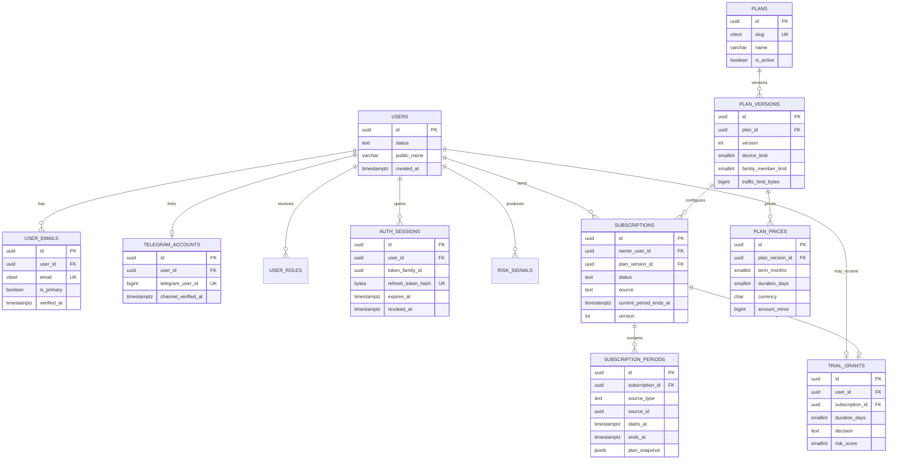
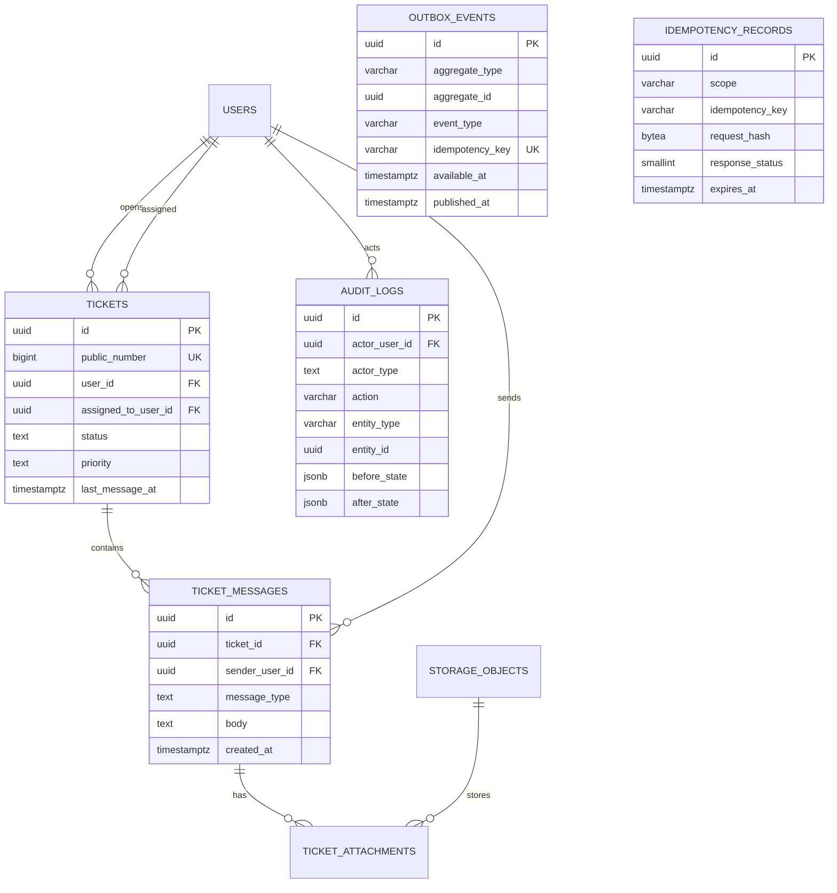

# STEP 2 — Database Schema и ER Diagram

## 1. Что создано

Создана исполнимая PostgreSQL 15+ схема для всех доменов платформы:

- identity, email OTP, Telegram accounts, sessions, RBAC и risk signals;
- versioned планы, цены и сроки 1/3/6/12 месяцев;
- subscriptions, непересекающиеся entitlement periods и trial grants;
- family groups, invitations и membership history;
- desired/observed Remnawave accounts, локальные device slots и sync commands;
- payment screenshots, Gemini analyses и manual reviews;
- double-entry ledger вместо изменяемого поля `users.balance`;
- referrals, rewards, promo codes и redemptions;
- tickets, messages, attachments, audit, outbox и idempotency.

Артефакты этапа:

- `database/schema.sql` — полный reference DDL;
- `database/seeds/001_plan_catalog.sql` — Basic/Premium/Family без выдуманных цен;
- `database/tests/schema_smoke.sql` — транзакционный smoke test ограничений;
- этот документ — ER-модель, инварианты, индексы и migration policy.

Схема успешно развернута и проверена на чистой PostgreSQL 15: **39 таблиц** и
**132 индекса**, включая индексы, созданные для PK/UNIQUE/EXCLUDE constraints.

## 2. Почему такая модель

### Тариф отделен от срока покупки

`plans` — стабильная продуктовая сущность (`basic`, `premium`, `family`),
`plan_versions` — неизменяемая версия лимитов, а `plan_prices` — конкретный срок,
валюта и стоимость. Поэтому один тариф поддерживает 1, 3, 6 и 12 месяцев без
копирования продукта, а существующая подписка не меняется при обновлении цен.

### Subscription отделена от entitlement periods

`subscriptions` хранит текущий lifecycle, а `subscription_periods` — историю
выданных периодов и коммерческий snapshot. PostgreSQL exclusion constraint не
позволяет пересекающиеся периоды одной подписки. Продление добавляет новый
период, а не переписывает старый.

### Баланс — проекция проводок

Поля `users.balance` нет. `transactions` и `transaction_entries` образуют
double-entry ledger: posted-транзакция содержит минимум две проводки одной
валюты, сумма которых равна нулю. После posting заголовок и проводки неизменяемы;
исправление выполняется reversal-транзакцией. Баланс кошелька — сумма проводок
по его `ledger_account`.

### Remnawave синхронизируется через desired/observed state

`vpn_accounts` одновременно хранит целевое состояние платформы и последний
наблюдаемый state Remnawave. `vpn_sync_commands` дает retry/idempotency/dead-letter
модель. `devices` поддерживает зарезервированный локальный slot до подтверждения
Remnawave. В STEP 5 уточнено, что OpenAPI v3.3.2 содержит
`POST /api/hwid/devices`; локальный `reserved` state остается необходим для
атомарного контроля лимитов и надежной асинхронной доставки команды.

### AI не является источником финансового решения

Каждая попытка Gemini сохраняется в `payment_analyses` с моделью, версией prompt,
извлеченными полями, confidence и результатами детерминированных правил.
`payment_reviews` хранит единственное финальное ручное решение с версией payment
для optimistic locking. Только переход payment в `approved` запускает ledger и
активацию.

## 3. ER Diagram — Identity, Catalog и Subscriptions



## 4. ER Diagram — Family, VPN и Devices

```mermaid
erDiagram
    USERS ||--o{ FAMILY_GROUPS : owns
    SUBSCRIPTIONS ||--o| FAMILY_GROUPS : powers
    FAMILY_GROUPS ||--o{ FAMILY_INVITATIONS : sends
    FAMILY_GROUPS ||--o{ FAMILY_MEMBERS : contains
    USERS ||--o{ FAMILY_MEMBERS : joins
    USERS ||--o{ FAMILY_INVITATIONS : receives

    USERS ||--o{ VPN_ACCOUNTS : uses
    SUBSCRIPTIONS ||--o{ VPN_ACCOUNTS : entitles
    VPN_ACCOUNTS ||--o{ DEVICES : observes
    VPN_ACCOUNTS ||--o{ VPN_SYNC_COMMANDS : synchronizes

    FAMILY_GROUPS {
        uuid id PK
        uuid owner_user_id FK
        uuid subscription_id FK_UK
        text status
        smallint member_limit
    }
    FAMILY_INVITATIONS {
        uuid id PK
        uuid family_group_id FK
        uuid invited_user_id FK
        citext invited_email
        bytea token_hash UK
        text status
        timestamptz expires_at
    }
    FAMILY_MEMBERS {
        uuid id PK
        uuid family_group_id FK
        uuid user_id FK
        timestamptz joined_at
        timestamptz left_at
    }
    VPN_ACCOUNTS {
        uuid id PK
        uuid user_id FK
        uuid subscription_id FK
        bigint remnawave_user_id UK
        citext username UK
        text desired_status
        text observed_status
        timestamptz desired_expires_at
        timestamptz observed_expires_at
    }
    DEVICES {
        uuid id PK
        uuid user_id FK
        uuid vpn_account_id FK
        smallint slot_number
        varchar external_hwid
        text status
        timestamptz last_seen_at
    }
    VPN_SYNC_COMMANDS {
        uuid id PK
        uuid vpn_account_id FK
        text command_type
        varchar idempotency_key UK
        text status
        smallint attempt_count
        timestamptz next_attempt_at
    }
```

Owner не дублируется в `family_members`: таблица содержит только приглашенных
участников. Лимит участников проверяется в транзакции с `SELECT ... FOR UPDATE`
на `family_groups`; частичные UNIQUE-индексы не позволяют одному пользователю
одновременно состоять в двух активных группах.

## 5. ER Diagram — Payments и Ledger

```mermaid
erDiagram
    USERS ||--o{ PAYMENTS : submits
    PLAN_PRICES ||--o{ PAYMENTS : purchases
    PAYMENTS ||--o{ PAYMENT_EVIDENCE : includes
    STORAGE_OBJECTS ||--o{ PAYMENT_EVIDENCE : stores
    PAYMENT_EVIDENCE ||--o{ PAYMENT_ANALYSES : analyzed_as
    PAYMENTS ||--o{ PAYMENT_ANALYSES : evaluated_by
    PAYMENTS ||--o| PAYMENT_REVIEWS : reviewed_by
    USERS ||--o{ PAYMENT_REVIEWS : decides

    USERS ||--o{ LEDGER_ACCOUNTS : owns_wallet
    USERS ||--o{ TRANSACTIONS : benefits
    PAYMENTS ||--o| TRANSACTIONS : creates
    TRANSACTIONS ||--|{ TRANSACTION_ENTRIES : posts
    LEDGER_ACCOUNTS ||--o{ TRANSACTION_ENTRIES : receives
    TRANSACTIONS o|--o| TRANSACTIONS : reverses

    PAYMENTS {
        uuid id PK
        uuid user_id FK
        uuid plan_price_id FK
        text status
        bigint expected_amount_minor
        char currency
        varchar operation_number_normalized
        int version
    }
    STORAGE_OBJECTS {
        uuid id PK
        uuid owner_user_id FK
        varchar object_key UK
        bytea sha256
        text status
        timestamptz retention_until
    }
    PAYMENT_ANALYSES {
        uuid id PK
        uuid payment_id FK
        uuid evidence_id FK
        smallint attempt
        varchar model
        varchar prompt_version
        numeric confidence
        jsonb extracted_data
    }
    PAYMENT_REVIEWS {
        uuid id PK
        uuid payment_id FK_UK
        uuid reviewer_user_id FK
        text decision
        int payment_version
    }
    LEDGER_ACCOUNTS {
        uuid id PK
        uuid owner_user_id FK
        varchar account_key
        text account_type
        char currency
    }
    TRANSACTIONS {
        uuid id PK
        uuid user_id FK
        uuid payment_id FK_UK
        text transaction_type
        text status
        char currency
        varchar idempotency_key UK
    }
    TRANSACTION_ENTRIES {
        uuid id PK
        uuid transaction_id FK
        uuid ledger_account_id FK
        bigint amount_minor
    }
```

## 6. ER Diagram — Referrals и Promo Codes

```mermaid
erDiagram
    USERS ||--o{ REFERRAL_CODES : owns
    REFERRAL_CODES ||--o{ REFERRALS : attributes
    USERS ||--o{ REFERRALS : refers
    USERS ||--o| REFERRALS : is_referred
    REFERRALS ||--o{ REFERRAL_REWARDS : produces
    USERS ||--o{ REFERRAL_REWARDS : receives
    TRANSACTIONS o|--o{ REFERRAL_REWARDS : credits
    SUBSCRIPTION_PERIODS o|--o{ REFERRAL_REWARDS : extends

    PROMO_CODES ||--o{ PROMO_CODE_PLAN_VERSIONS : applies_to
    PLAN_VERSIONS ||--o{ PROMO_CODE_PLAN_VERSIONS : accepts
    PROMO_CODES ||--o{ PROMO_REDEMPTIONS : redeemed_as
    USERS ||--o{ PROMO_REDEMPTIONS : redeems
    PAYMENTS o|--o{ PROMO_REDEMPTIONS : discounts
    SUBSCRIPTION_PERIODS o|--o{ PROMO_REDEMPTIONS : grants

    REFERRAL_CODES {
        uuid id PK
        uuid owner_user_id FK
        citext code UK
        text status
        int usage_limit
    }
    REFERRALS {
        uuid id PK
        uuid referral_code_id FK
        uuid referrer_user_id FK
        uuid referred_user_id FK_UK
        text status
    }
    REFERRAL_REWARDS {
        uuid id PK
        uuid referral_id FK
        uuid beneficiary_user_id FK
        text reward_side
        text reward_type
        smallint days
        bigint amount_minor
    }
    PROMO_CODES {
        uuid id PK
        citext code UK
        text promo_type
        int value
        int usage_limit
        smallint per_user_limit
        timestamptz expires_at
    }
    PROMO_REDEMPTIONS {
        uuid id PK
        uuid promo_code_id FK
        uuid user_id FK
        uuid payment_id FK
        uuid subscription_period_id FK
        bigint discount_amount_minor
        smallint free_days
    }
```

## 7. ER Diagram — Support и Platform Infrastructure



`outbox_events` и `idempotency_records` не имеют polymorphic foreign key к
aggregate/resource: разные домены могут удалять или архивировать записи, а
инфраструктурный журнал обязан сохранять идентификатор события.

## 8. Каталог таблиц

| Domain | Таблицы | Назначение |
|---|---|---|
| Identity | `users`, `user_emails`, `telegram_accounts`, `user_roles` | Аккаунт и проверенные identity |
| Authentication | `auth_sessions`, `otp_challenges`, `risk_signals` | Refresh rotation, OTP, anti-abuse evidence |
| Catalog | `plans`, `plan_versions`, `plan_prices` | Product, immutable limits, term/currency price |
| Subscription | `subscriptions`, `subscription_periods`, `trial_grants` | Lifecycle, entitlement history, one trial per user |
| Family | `family_groups`, `family_invitations`, `family_members` | Owner subscription и история seats |
| VPN | `vpn_accounts`, `devices`, `vpn_sync_commands` | Remnawave projection и retryable commands |
| Storage | `storage_objects` | Metadata/retention для S3 objects |
| Payments | `payments`, `payment_evidence`, `payment_analyses`, `payment_reviews` | Screenshot verification и decision trail |
| Ledger | `ledger_accounts`, `transactions`, `transaction_entries` | Проверяемая финансовая история |
| Referral | `referral_codes`, `referrals`, `referral_rewards` | Attribution и две независимые rewards |
| Promo | `promo_codes`, `promo_code_plan_versions`, `promo_redemptions` | Discount/free-days и usage tracking |
| Support | `tickets`, `ticket_messages`, `ticket_attachments` | Ticket state и correspondence |
| Platform | `audit_logs`, `outbox_events`, `idempotency_records` | Audit, reliable events, request replay safety |

## 9. Инварианты на уровне PostgreSQL

- Email и promo/referral codes сравниваются case-insensitive через `citext`.
- Один primary email на пользователя и один Telegram ID на аккаунт.
- Один live commercial subscription на owner.
- Trial grant уникален для user и обязан ссылаться на subscription того же owner.
- Family group обязана ссылаться на subscription своего owner.
- Один пользователь может быть участником только одной активной family group.
- Периоды одной subscription не пересекаются (`EXCLUDE ... tstzrange`).
- Один live VPN account на пользователя; username и Remnawave IDs уникальны.
- HWID уникален в рамках VPN account; observed device обязан иметь HWID.
- Payment operation number + recipient + currency нельзя одобрить повторно.
- Одна manual review и одна ledger transaction на payment.
- Referral не может быть self-referral; один referred user имеет одну attribution.
- Posted ledger transaction сбалансирована и immutable.
- Audit log append-only на уровне DB trigger.
- Currency хранится ISO-like uppercase `CHAR(3)`, деньги — только `BIGINT` minor
  units; `float`/`numeric` для денег не используется.

State transition graph, seat limits, promo usage counters и authorization требуют
application transaction, потому что зависят от actor/context. В STEP 4 они будут
реализованы domain services с row locking и optimistic `version` checks.

## 10. Индексная стратегия

- Частичные индексы покрывают только hot queues/live rows: active sessions,
  expiring subscriptions, payment review, outbox, VPN retry и open tickets.
- Admin lists используют составные индексы `status + created_at/expiry`.
- Исторические ленты индексируются по FK и времени DESC.
- Case-insensitive lookup опирается на unique B-tree `citext`.
- `subscription_periods` использует GiST exclusion index из `btree_gist`.
- JSONB сознательно не имеет универсального GIN: индекс появится только под
  измеренный query pattern, чтобы не удорожать все записи.

До production выполняется `EXPLAIN (ANALYZE, BUFFERS)` на реальных admin/search
queries. `users` и `payments` не получают broad `LIKE` search; для масштабного
поиска будет отдельная нормализованная search projection либо trigram index.

## 11. Retention и удаление

| Данные | Начальная policy |
|---|---|
| OTP | Удалять после 24 часов, независимо от результата |
| Idempotency records | 24–72 часа по endpoint class |
| Raw risk signals | Ограниченный TTL по privacy policy |
| Payment screenshot | До завершения dispute/compliance срока, затем удалить object и отметить metadata |
| Payment analysis/review | Сохранять как financial decision evidence |
| Sessions | Удалять/архивировать после истечения и security retention |
| Tickets | По support/privacy policy; attachments отдельно |
| Audit/ledger | Не удалять обычным application flow; архивировать по compliance policy |
| Outbox | Архивировать опубликованные события после operational window |

Пользователь удаляется через anonymization workflow: внешние identity и PII
стираются, но финансовые и audit references остаются через surrogate UUID.
Каскадное удаление используется только для зависимостей, не имеющих собственной
юридической/финансовой истории.

## 12. Код и как проверить

Создать пустую базу и применить schema:

```bash
createdb hazbit_vpn
psql -v ON_ERROR_STOP=1 -d hazbit_vpn -f database/schema.sql
psql -v ON_ERROR_STOP=1 -d hazbit_vpn -f database/seeds/001_plan_catalog.sql
```

Запустить smoke test (он завершает все изменения через `ROLLBACK`):

```bash
psql -v ON_ERROR_STOP=1 -d hazbit_vpn -f database/tests/schema_smoke.sql
```

Smoke test проверяет:

- case-insensitive уникальность email;
- запрет пересекающихся subscription periods;
- ownership subscription для family group и создание membership;
- запрет posting несбалансированной ledger transaction;
- posting сбалансированной ledger transaction;
- запрет изменения и добавления posted entries;
- вычисление wallet balance как суммы проводок.

Reference DDL не заменяет Alembic history. В STEP 3 он будет преобразован в
последовательность миграций и SQLAlchemy 2.x models; production никогда не
запускает `schema.sql` поверх существующей базы.

## 13. Migration policy для STEP 3+

1. Alembic revision неизменяема после merge/deploy.
2. Миграции используют expand → backfill → switch → contract.
3. Большие индексы создаются `CONCURRENTLY` отдельной non-transactional revision.
4. Новые обязательные поля сначала nullable/default, затем backfill и только
   потом `NOT NULL`.
5. State/value CHECK расширяется до выката кода, который пишет новое значение.
6. Удаление колонки выполняется минимум через один release после прекращения
   чтения/записи.
7. Каждая migration проверяется на пустой БД и на snapshot предыдущей версии.
8. Restore/PITR тестируется отдельно; rollback migration не считается backup.

## 14. Возможные улучшения

- hash-chain/WORM export для audit logs;
- monthly partitioning для `audit_logs`, `risk_signals`, `outbox_events` и
  `ticket_messages` после подтверждения объема;
- read model/materialized view для admin dashboard и wallet balances;
- PostgreSQL RLS как второй слой ownership защиты;
- отдельные payment recipients/bank accounts как versioned configuration;
- country-specific tax invoice/refund entities;
- temporal plan/promo eligibility rules;
- encrypted columns через application envelope encryption/KMS для особенно
  чувствительных данных.

## 15. Критерии готовности STEP 2

- [x] Все сущности из product brief представлены в схеме.
- [x] ER-модель разбита на читаемые domain diagrams.
- [x] Важные ownership и uniqueness rules закреплены DB constraints.
- [x] История тарифов, подписок, платежей и rewards не перезаписывается.
- [x] Поддержаны family seats и Remnawave desired/observed state.
- [x] Payment AI evidence отделен от финансового решения.
- [x] Реализован сбалансированный immutable ledger.
- [x] DDL и high-value invariants проверены на PostgreSQL 15.

Следующий этап: **STEP 3 — Backend Foundation**: FastAPI skeleton, settings,
SQLAlchemy 2.x mappings, Alembic initial revision, async sessions, health checks,
structured logging, test containers и базовый CI.
